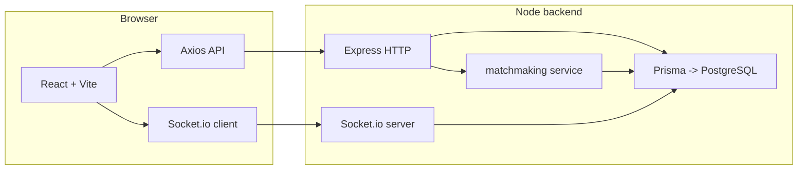

# One Face (Unface) — полный контекст проекта для LLM

Документ описывает назначение приложения, технологический стек, архитектуру, модель данных, HTTP API, события Socket.io, потоки пользователя и структуру кода. Его можно целиком вставлять в ChatGPT или другой чат как системный/контекстный промпт при работе с репозиторием.

---

## 1. Назначение продукта

**One Face** — веб-платформа для **анонимного общения между учениками одной школы** с **автоматическим подбором собеседника** (matchmaking). Пользователь не видит личных данных собеседника в интерфейсе (отображается «Анонимный собеседник»). Есть **регистрация с привязкой к школе**, **JWT-аутентификация**, **чат в реальном времени** через Socket.io, **жалобы** на чат с закрытием диалога и пометкой для модерации, **админ-панель** по email из переменной окружения (бан пользователей, просмотр пользователей/чатов/жалоб, детальный просмотр чата с сообщениями).

Репозиторий монорепо в папке `Unface/`: отдельные пакеты `backend/` и `frontend/` без общего workspace-файла на уровне корня (каждый со своим `package.json`).

---

## 2. Технологический стек (версии из package.json)

### 2.1. Runtime и общее

| Компонент | Версия / требование | Роль |
|-----------|---------------------|------|
| Node.js | 18+ | Серверный runtime |
| TypeScript | ~5.6 | Типизация backend и frontend |
| PostgreSQL | 14+ | Хранилище |

### 2.2. Backend (`backend/package.json`)

| Технология | Назначение |
|------------|------------|
| **Express** 4.x | HTTP API, middleware |
| **http** (Node) | Общий сервер для Express + Socket.io |
| **Socket.io** 4.7 | WebSocket: комнаты чатов, сообщения, завершение чата |
| **Prisma** 5.22 | ORM, миграции, `PrismaClient` |
| **@prisma/client** | Сгенерированный клиент к БД |
| **jsonwebtoken** | JWT (`userId` в payload) |
| **bcrypt** | Хеш паролей (cost 10 при регистрации/seed) |
| **cors** | CORS для фронтенда |
| **helmet** | Заголовки безопасности HTTP |
| **express-rate-limit** | Лимит на `/api/auth/login` и `/api/auth/register` (20 запросов / 15 мин) |
| **validator** | `isEmail`, `normalizeEmail`, `trim`, `escape` для входных данных |
| **tsx** (dev) | Запуск TS без предсборки (`tsx watch src/index.ts`) |

Скрипты: `dev`, `build` (`tsc`), `start` (`node dist/index.js`), `prisma:generate`, `prisma:migrate`, `prisma:studio`, `db:seed` / `prisma:seed` → `tsx prisma/seed.ts`.

### 2.3. Frontend (`frontend/package.json`)

| Технология | Назначение |
|------------|------------|
| **React** 18.3 | UI |
| **Vite** 5.4 | Сборка, dev-сервер (порт 5173) |
| **React Router** 6.28 | Маршруты (`BrowserRouter`) |
| **Axios** | HTTP к API (`baseURL` = `{VITE_API_URL\|\|localhost:3001}/api`) |
| **Socket.io-client** | Подключение к тому же хосту, что и API |
| **Tailwind CSS** 3.4 | Стили (`darkMode: 'class'`) |
| **PostCSS** + **Autoprefixer** | Обработка CSS |

### 2.4. Инструменты Prisma

- Схема: `backend/prisma/schema.prisma`
- Seed: `backend/prisma/seed.ts` — школы и демо-пользователи (в т.ч. админ)

---

## 3. Архитектура (высокий уровень)



- Один процесс Node: `createServer(app)` + `new Server(httpServer, { cors })`.
- JWT для REST: заголовок `Authorization: Bearer <token>`.
- JWT для Socket: `socket.handshake.auth.token` (тот же секрет `JWT_SECRET`).
- Модуль `lib/socketIo.ts` хранит ссылку на экземпляр `io` для **emit из HTTP-обработчиков** (например, при жалобе — уведомить комнату о `disconnect_chat`).

---

## 4. Переменные окружения

### Backend (`.env`, см. `.env.example`)

| Переменная | Назначение |
|------------|------------|
| `DATABASE_URL` | Строка подключения PostgreSQL для Prisma |
| `JWT_SECRET` | Секрет подписи JWT (обязателен в runtime) |
| `PORT` | Порт HTTP (по умолчанию 3001) |
| `NODE_ENV` | `development` / production |
| `FRONTEND_URL` | Origin для CORS и Socket.io (по умолчанию `http://localhost:5173`) |
| `ADMIN_EMAIL` | Email пользователя с правами админа (по умолчанию `admin@oneface.ru`) |

### Frontend

| Переменная | Назначение |
|------------|------------|
| `VITE_API_URL` | Базовый URL бэкенда без `/api` (по умолчанию `http://localhost:3001`) |

`vite.config.ts` проксирует `/api` и `/socket.io` на `localhost:3001` — удобно при разработке.

---

## 5. Модель данных (Prisma)

Файл: `backend/prisma/schema.prisma`. Провайдер БД: **PostgreSQL**.

### School
- `id`, `name` (unique)
- Связь: много `User`

### User
- `id`, `email` (unique), `password` (хеш bcrypt)
- `schoolId` → School
- `phoneNumber` (optional), `birthDate`
- `chatStatus`: строка, по смыслу **`idle` | `searching` | `in_chat`** (в коде задаётся этими значениями)
- `banStatus` (boolean) — при `true` логин и `authMiddleware` отклоняются
- `policyAgreed` — согласие с политикой при регистрации
- `createdAt`
- Связи: чаты как `user1` / `user2`, `messages`, исходящие `reportsSent`

### Chat
- `user1Id`, `user2Id` — **в коде всегда сортируются по возрастанию id** при создании, чтобы пара была канонической
- `status`: **`active` | `closed`**
- `reportStatus`: `null` | **`pending`** | **`resolved`** (в схеме nullable string)
- `messages`, `reports`

### Message
- `chatId`, `userId`, `text`, `createdAt`

### Report
- `chatId`, `fromUserId`, `reason`, `createdAt`

Каскадное удаление на связях с User/Chat там, где указано `onDelete: Cascade`.

---

## 6. Backend: структура каталогов и ответственность

```
backend/src/
  index.ts           — точка входа: Express, httpServer, io, middleware, маршруты, setupSocket
  lib/
    prisma.ts        — экспорт singleton PrismaClient
    socketIo.ts      — attachSocketIo(io), emitChatClosed(chatId)
  middleware/
    auth.ts          — JWT из Bearer, загрузка User, проверка ban, req.userId
    errorHandler.ts  — класс AppError, JSON-ответы с кодом
  routes/
    auth.ts          — register, login, logout, me
    user.ts          — profile GET/PUT (все под authMiddleware)
    matchmaking.ts   — find-chat, next-chat, stop-search
    chat.ts          — current, history, report
    admin.ts         — users, chats, reports, chats/:id, ban-user, unban-user
  services/
    matchmaking.ts   — findMatch(userId)
  socket/
    index.ts         — setupSocket(io): JWT handshake, события сокета
  utils/
    sanitize.ts      — sanitizeString, sanitizeEmail (validator)
```

---

## 7. Ключевая логика backend

### 7.1. Регистрация (`POST /api/auth/register`)

- Требуется `policyAgreed === true`.
- Email: trim, `normalizeEmail`, проверка `validator.isEmail`.
- Пароль = confirm, длина ≥ 6.
- Школа: строка после sanitize, **если школы нет — создаётся новая запись School**.
- Возраст с `birthDate`: функция `calculateAge` — регистрация **с 14 лет** (младше — ошибка 400).
- Пароль хешируется bcrypt; ответ 201 с `token` (7d) и кратким `user`.

### 7.2. Вход (`POST /api/auth/login`)

- Проверка email; пользователь с `banStatus` → 403.
- bcrypt.compare; JWT 7d.

### 7.3. `GET /api/auth/me` (с JWT)

- Возвращает пользователя с `school.name`, `birthDate`, `chatStatus`.

### 7.4. Matchmaking (`services/matchmaking.ts`)

`findMatch(userId)`:

1. Загружает пользователя с `school`.
2. Если нет пользователя или `chatStatus !== 'searching'` → `null`.
3. Диапазон **`birthDate`: ±1 год** от текущего пользователя (`setFullYear` ±1).
4. Ищет других пользователей: **та же `schoolId`**, `chatStatus === 'searching'`, не бан, `id !== userId`, `birthDate` в диапазоне.
5. Из кандидатов выбирается **случайный**.
6. Повторный матч с тем же человеком **разрешён** (в комментарии в коде явно сказано).

Маршруты:

- **`POST /api/matchmaking/find-chat`**: ставит пользователя в `searching`, вызывает `findMatch`. Если пары нет → **202** `{ waiting: true, message: ... }`. Если есть — создаётся `Chat` (user1Id/user2Id отсортированы), оба в `in_chat`. Если активный чат между этой парой уже есть — 409.
- **`POST /api/matchmaking/next-chat`**: закрывает активный чат текущего пользователя (если был), переводит участников в `idle`, ставит себя в `searching`, ищет матч; если никого нет — возвращает в `idle` и **AppError 404** «Нет доступных пользователей…». Иначе новый чат.
- **`POST /api/matchmaking/stop-search`**: `chatStatus` → `idle`.

### 7.5. Chat REST

- **`GET /api/chat/current`**: активный чат пользователя с сообщениями по возрастанию времени; `partnerId` вычисляется как второй участник.
- **`GET /api/chat/history`**: до 50 закрытых чатов, у каждого до 5 последних сообщений (краткий превью).
- **`POST /api/chat/report`**: тело `{ chatId, reason }`. Проверка участия и `status: active`. Создаётся Report; чат: `reportStatus: pending`, `status: closed`; оба пользователя `idle`; **`emitChatClosed(chat.id)`** для Socket.io.

### 7.6. Admin (`routes/admin.ts`)

- После `authMiddleware` — **`adminCheck`**: email пользователя должен совпадать с `ADMIN_EMAIL`.
- `GET /admin/users`, `/admin/chats`, `/admin/reports` — списки с нужными include.
- `GET /admin/chats/:chatId` — полный чат с сообщениями и email участников (для модерации).
- `POST /admin/ban-user`, `POST /admin/unban-user` — тело `{ userId }`.

### 7.7. Socket.io (`socket/index.ts`)

**Handshake middleware**: токен из `socket.handshake.auth.token`, верификация JWT, `socket.userId`.

События:

| Событие (клиент → сервер) | Поведение |
|---------------------------|-----------|
| `join_chat` (chatId) | Если пользователь — участник активного чата → `socket.join('chat:' + chatId)` |
| `send_message` `{ chatId, text }` | Проверка участника и активного чата; текст: trim, escape, max 1000; создание Message; **broadcast** в комнату `receive_message` с `id, text, userId, createdAt` |
| `next_chat` (chatId) | Участникам комнаты `disconnect_chat`; чат `closed`; оба `idle` |
| `disconnect` | Заглушка (статус при отключении не обновляется) |

`lib/socketIo.ts`: **`emitChatClosed`** — `io.to('chat:' + chatId).emit('disconnect_chat')` для сценария жалобы из HTTP.

---

## 8. Frontend: структура и поведение

### 8.1. Точка входа

- `main.tsx`: `BrowserRouter` → `ThemeProvider` → `AuthProvider` → `App`.
- Глобальные стили: `index.css` (Tailwind + кастом, в т.ч. класс `bg-watercolor` и кнопки).

### 8.2. Контексты

- **AuthContext**: токен в `localStorage` (`token`); при наличии токена — запрос `GET /auth/me` (через axios `baseURL` …`/api` → путь **`/auth/me`**). `login` / `register` сохраняют токен и user. `logout` очищает storage.
- **ThemeContext**: ключ `oneface-theme` в localStorage, класс `dark` на `document.documentElement`, учёт `prefers-color-scheme`.

### 8.3. HTTP-клиент (`api/client.ts`)

- `baseURL = (VITE_API_URL || http://localhost:3001) + '/api'`
- Интерцептор: подставляет `Authorization: Bearer <token>`.
- При ответе **401** — удаление токена и `window.location.href = '/login'`.

**Важно:** пути в запросах должны быть **без второго префикса `/api`** (например `/auth/login`, `/chat/current`). В проекте есть вспомогательные файлы `api/auth.ts` и `api/chat.ts` с путями вида `/api/auth/...` — при использовании с текущим `client` они дали бы дублирование (`/api/api/...`). Основной UI использует прямые вызовы из `ChatPage`, `AuthContext` и т.д. с **корректными** путями.

### 8.4. Маршруты (`App.tsx`)

| Путь | Защита | Страница |
|------|--------|----------|
| `/` | — | HomePage |
| `/login`, `/register` | PublicRoute (редирект на `/chat` если уже залогинен) | Login, Register |
| `/chat` | ProtectedRoute | ChatPage |
| `/account` | ProtectedRoute | ProfilePage |
| `/admin` | ProtectedRoute | AdminPage |
| `*` | — | редирект на `/` |

`ThemeToggle` рендерится глобально поверх маршрутов.

### 8.5. ChatPage (основной сценарий)

- При загрузке: `GET /chat/current` — если есть чат, состояние + **Socket.io** на `API_URL` с `auth: { token }`, после `connect` → `emit('join_chat', chatId)`.
- **Поиск:** `POST /matchmaking/find-chat`. Если **202** и `waiting` — состояние ожидания и **polling каждые 2 сек** `GET /chat/current` до появления чата. Кнопка «Отменить поиск» → `POST /matchmaking/stop-search`.
- Сообщения: `emit('send_message', { chatId, text })`; входящие через `receive_message` дописываются в state.
- **Следующий чат:** сначала `emit('next_chat', chat.id)` (закрытие на сервере), локально `nextChatInProgress` чтобы игнорировать свой `disconnect_chat` как «полный сброс» до завершения логики; затем `POST /matchmaking/next-chat` и новый сокет.
- **Жалоба:** `POST /chat/report`, отключение сокета, сброс чата.

### 8.6. Прочие страницы

- **LoginPage / RegisterPage** — формы, вызовы `login` / `register` из контекста.
- **ProfilePage** — данные профиля и обновление телефона (через API user).
- **AdminPage** — параллельная загрузка `/admin/users`, `/admin/chats`, `/admin/reports`; бан/разбан; просмотр деталей чата по `GET /admin/chats/:chatId`.

### 8.7. UI / дизайн

- Tailwind с кастомной палитрой (`brand`, `chat`, `pastel`, `charcoal` и др. в `tailwind.config.js`).
- Поддержка тёмной темы для чата и карточек.

---

## 9. Полный перечень HTTP API (как на бэкенде)

Базовый префикс: **`/api`**.

**Auth**

- `POST /api/auth/register`
- `POST /api/auth/login`
- `POST /api/auth/logout` (тело не обязательно; сервер просто отвечает сообщением)
- `GET /api/auth/me` — JWT

**User** (JWT)

- `GET /api/user/profile`
- `PUT /api/user/profile` — опционально `phoneNumber`

**Matchmaking** (JWT)

- `POST /api/matchmaking/find-chat`
- `POST /api/matchmaking/next-chat`
- `POST /api/matchmaking/stop-search`

**Chat** (JWT)

- `GET /api/chat/current`
- `GET /api/chat/history`
- `POST /api/chat/report` — `{ chatId, reason }`

**Admin** (JWT + email = ADMIN_EMAIL)

- `GET /api/admin/users`
- `GET /api/admin/chats`
- `GET /api/admin/reports`
- `GET /api/admin/chats/:chatId`
- `POST /api/admin/ban-user` — `{ userId }`
- `POST /api/admin/unban-user` — `{ userId }`

---

## 10. События Socket.io (сводка)

| Направление | Имя | Полезная нагрузка |
|-------------|-----|-------------------|
| C→S | `join_chat` | `chatId: number` |
| C→S | `send_message` | `{ chatId, text }` |
| C→S | `next_chat` | `chatId: number` |
| S→C | `receive_message` | `{ id, text, userId, createdAt }` |
| S→C | `disconnect_chat` | без тела (закрытие чата или жалоба) |

Аутентификация: `io(url, { auth: { token } })`.

---

## 11. Безопасность (реализовано в коде)

- Helmet, CORS с `FRONTEND_URL`, rate limit на login/register.
- Пароли не хранятся в открытом виде (bcrypt).
- JWT для API и сокетов; бан проверяется в `authMiddleware` и при логине.
- Санитизация строк и email; HTML-escape текста сообщений (`validator.escape`).
- Админ — по совпадению email с env (в коде отмечено, что в production нужны роли).

---

## 12. Демо-данные (seed)

После `npm run db:seed` в README указаны аккаунты, например:

- `student1@school.ru` / `password123`
- `admin@oneface.ru` / `password123` — для `/admin` (при `ADMIN_EMAIL` по умолчанию)

---

## 13. Сборка и запуск

**Backend:** `cd backend && npm install &&` настроить `.env`, миграции Prisma, `npm run dev` → порт 3001.

**Frontend:** `cd frontend && npm install && npm run dev` → порт 5173.

**Production:** backend `npm run build && npm start`; frontend `npm run build` — статика из `dist/`, нужен внешний веб-сервер; `VITE_API_URL` должен указывать на публичный URL API.

---

## 14. Именование и бренд

В README и UI встречается название **One Face**; папка репозитория может называться **Unface**. Пакеты npm: `one-face-backend`, `one-face-frontend`.

---

*Конец контекстного документа. При изменении схемы БД, маршрутов или сокетов имеет смысл обновлять этот файл.*
